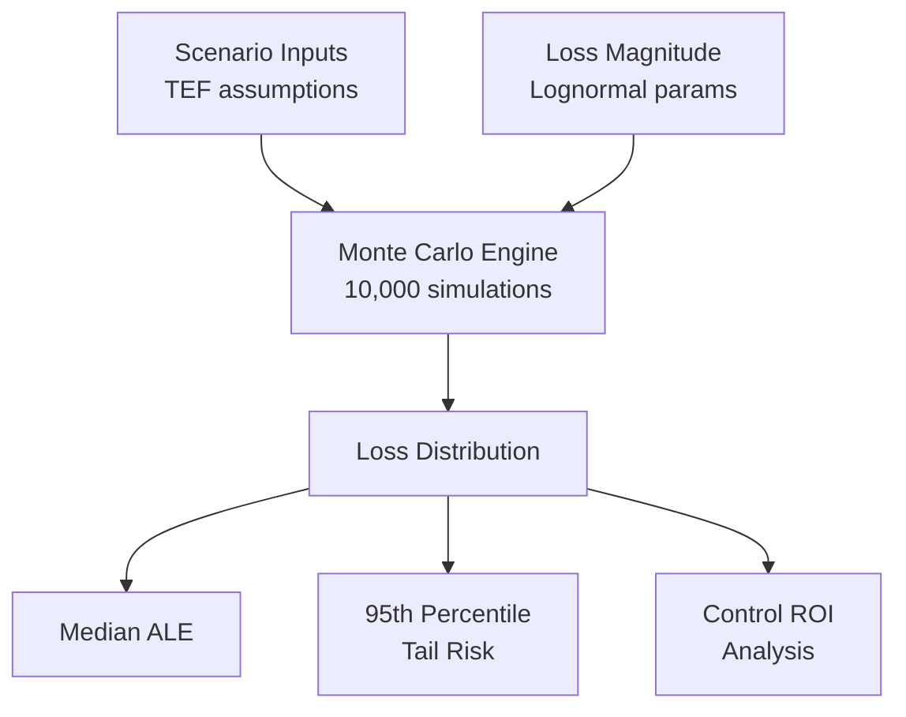
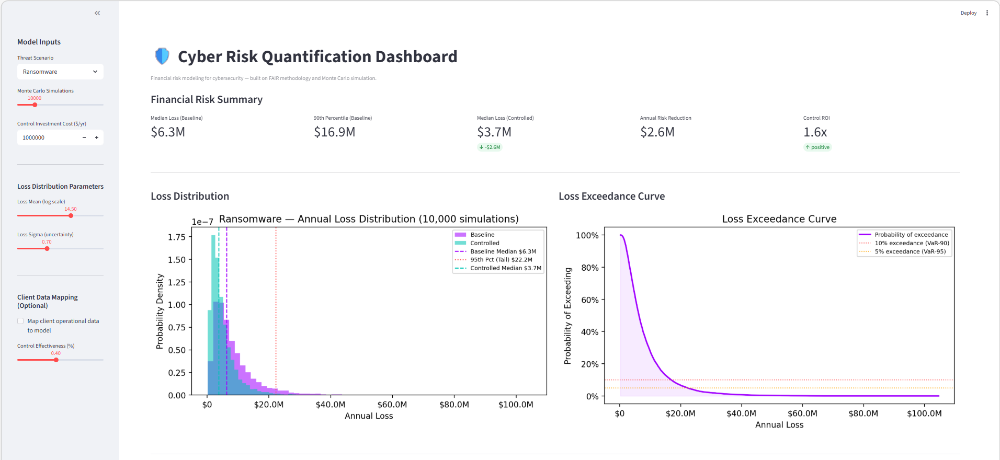

# Cyber Risk Quantification & Financial Modeling

> Translating cybersecurity risk into the language of the boardroom — probability, dollars, and ROI.

---

## The Problem with How We Talk About Cyber Risk

Most organisations measure cyber risk in the wrong units.

They count incidents. They track compliance scores. They rate risks as High, Medium, or Low. These metrics are useful operationally, but they fail at the level where decisions actually get made — capital allocation, investment prioritisation, and board-level accountability.

A CISO who says *"we have a High ransomware risk"* is not giving the CFO anything actionable. A CISO who says *"there is a 15% chance we lose more than $18M this year from a ransomware event, and a $1.5M investment in EDR reduces that exposure by 40%"* — that is a conversation that moves.

This project makes that conversation possible.

---

## What This Is

A **financial risk modeling framework** for cybersecurity, built on the FAIR (Factor Analysis of Information Risk) methodology and Monte Carlo simulation.

It answers three questions:

1. **What is our expected annual financial exposure?** *(loss modeling)*
2. **Which threat scenarios drive the most risk?** *(scenario analysis)*
3. **Which security investments are financially justified?** *(control ROI)*

---

## Methodology

### FAIR-Inspired Loss Model

Cyber risk is modeled as the product of two variables:

```
ALE = TEF × Loss Magnitude
```

| Variable | Definition | Distribution Used |
|----------|-----------|-------------------|
| **TEF** (Threat Event Frequency) | How often a threat materialises per year | Triangular (min, mode, max) |
| **Loss Magnitude** | Financial impact per event | Lognormal |

Both variables are uncertain — so instead of picking a single value, we run **10,000 Monte Carlo simulations** to produce a full distribution of possible annual losses.

### Why Monte Carlo?

Point estimates are misleading. A single "expected loss" number hides the shape of the risk. Monte Carlo simulation reveals:

- The **median** outcome (what you'd expect in a typical year)
- The **tail risk** — the 90th or 95th percentile losses that stress-test your resilience
- The **probability of exceeding** any given loss threshold

### Why Lognormal for Loss Magnitude?

Cyber losses are not normally distributed. Small losses are common; catastrophic losses are rare but possible. The lognormal distribution captures this asymmetry — the same shape used in insurance, operational risk, and financial risk modeling.

---

## Key Findings

| Scenario | Median Annual Loss | 95th Percentile |
|----------|--------------------|-----------------|
| Ransomware | ~$6.3M | ~$22.2M |
| Cloud Data Breach | ~$2.2M | ~$7.7M |
| AI Misuse | ~$9.0M | ~$30.4M |

**Control ROI at 40% effectiveness (baseline $1M investment):**
- Risk reduction: ~$2.5M/year
- ROI: ~1.5x
- At 80% effectiveness, ROI reaches ~4x

> The financially optimal question is not *"can we afford this control?"* — it is *"what is the expected return on this security investment?"*

---

## Architecture



---

## Dashboard



> Run `streamlit run app.py` to launch the interactive dashboard locally.

---

## Project Structure

```
cyber-risk-quantification/
├── app.py                              # Interactive Streamlit dashboard
├── notebooks/
│   ├── 01_fair_loss_model.ipynb       # Baseline ALE modeling
│   ├── 02_scenario_analysis.ipynb     # Ransomware vs Breach vs AI Misuse
│   └── 03_control_roi_analysis.ipynb  # Security investment ROI
├── requirements.txt                    # Python dependencies
└── README.md
```

---

## How to Run

### Prerequisites
- Python 3.9+

### Setup

```powershell
git clone https://github.com/rafatyazdani/cyber-risk-quantification.git
cd cyber-risk-quantification
python -m venv venv
venv\Scripts\Activate.ps1        # Windows
# source venv/bin/activate       # Mac/Linux
pip install -r requirements.txt
```

### Option A — Interactive Dashboard (Streamlit)

```powershell
streamlit run app.py
```

Opens at `http://localhost:8501`. Adjust scenario, control effectiveness, and client inputs in real time.

### Option B — Analytical Notebooks

```powershell
jupyter notebook
```

Run the three notebooks in order:
1. `01_fair_loss_model.ipynb` — understand the loss distribution
2. `02_scenario_analysis.ipynb` — compare threat scenarios
3. `03_control_roi_analysis.ipynb` — evaluate control investments

---

## Thought Leadership Applications

This framework supports several strategic conversations:

**Board & Executive Reporting**
Translate technical risk posture into financial exposure ranges that resonate with audit committees and risk committees.

**Security Investment Justification**
Move beyond "we need this tool" to "this investment returns $X per dollar spent by reducing our expected annual loss from $Y to $Z."

**Scenario Planning**
Model the financial impact of emerging threats (AI misuse, supply chain attacks) before they materialise, to inform proactive investment.

**Cyber Insurance Sizing**
Use the loss distribution to determine the right coverage threshold — insure against tail risk, self-insure the median.

---

## The Core Insight

> Cybersecurity is not a technical problem with financial consequences.
> It is a **financial risk problem** that happens to have technical solutions.

The sooner organisations frame it this way, the better their investment decisions will be.

---

## Dependencies

```
numpy
pandas
matplotlib
streamlit
jupyter
scipy
```

---

*Built using the FAIR (Factor Analysis of Information Risk) methodology.*

---

## License

MIT License — free to use, adapt, and share with attribution.
